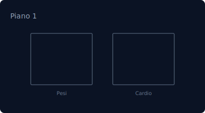
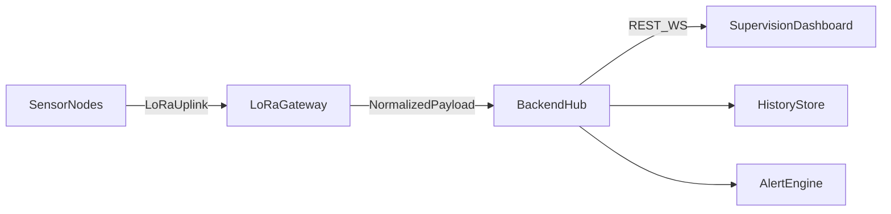

# LoRa IoT Supervision Dashboard

Piattaforma di supervisione per una rete di nodi sensore remoti con comunicazione LoRa, gateway centrale e dashboard web real-time per analisi, storico e allarmi.


---

## Panoramica

Questa applicazione è progettata come **centrale di controllo IoT distribuita**:

- nodi remoti installati sul campo misurano livello, temperatura, umidita, luce, flusso e qualità aria;
- un gateway centrale raccoglie i payload LoRa e li inoltra al backend;
- la dashboard React visualizza telemetria live, stato rete, allarmi e storico.

### Anteprima layout



---

## Funzionalita principali

- Dashboard React con UI moderna e supervisione real-time.
- Gateway Node.js/Express con endpoint REST e stream WebSocket.
- Catalogo di nodi, gateway e zone monitorate.
- Storico su file per analisi, report e trend.
- Allarmi ambientali e allarmi di rete (offline, batteria, segnale).
- Payload ingest compatibili con simulazione, Arduino/ESP e futuri nodi LoRa reali.

## Architettura



---

## Stack Tecnologico

### Frontend

- React 18
- Chart.js + react-chartjs-2
- lucide-react

### Backend

- Node.js + Express
- WebSocket (`ws`)
- Helmet, CORS, dotenv

---

## Quick Start

### Prerequisiti

- [Node.js](https://nodejs.org/) LTS (consigliato 18+)
- npm

### 1) Installazione dipendenze

```bash
npm install
npm --prefix server install
```

### 2) Avvio stack completo (consigliato)

```bash
npm run stack
```

Avvia:

- frontend su `http://localhost:3000`
- backend/gateway su `http://localhost:4000`

### 2-bis) Demo preset (frontend + simulatore LoRa)

```bash
npm run demo
```

Avvia frontend e simulatore gateway LoRa in parallelo, utile per demo senza hardware.

### 2-ter) Demo pulita e ripetibile (reset + avvio)

```bash
npm run demo:clean
```

Resetta i file JSONL demo (`readings` + `network-events`) e avvia lo stack demo.

### 3) Avvio frontend standalone (mock/simulato)

```bash
npm start
```

### 4) Avvio solo backend

```bash
npm run server
```

---

## Configurazione Ambiente

- Frontend: copia `.env.example` in `.env` (se necessario).
- Backend: copia `server/.env.example` in `server/.env`.

Note utili:

- se `REQUIRE_AUTH=true`, `AUTH_PASSWORD` e obbligatoria;
- `CORS_ORIGIN` supporta lista separata da virgole;
- con `npm run stack` il frontend usa il gateway in modalita proxy.
- puoi usare preset demo rapidi con `.env.demo` (root e `server/.env.demo`).

---

## Rete prototipo

Configurazione iniziale prevista:

- `gw-livorno-01`: gateway LoRa centrale
- `node-water-01`: livello/temperatura serbatoio tecnico
- `node-env-01`: temperatura/umidita/luce spogliatoi
- `node-flow-01`: portata linea idrica
- `node-air-01`: qualità aria sala pesi
- `node-light-01`: luce/temperatura area cardio

## API Rapide

### Ingest sensori / gateway

`POST /api/ingest/reading`

Esempio payload LoRa-ready:

```json
{
  "nodeId": "node-air-01",
  "zoneId": "sala-pesi-aria",
  "gatewayId": "gw-livorno-01",
  "timestamp": "2026-04-15T19:30:00Z",
  "source": "lora-gateway",
  "batteryPercent": 87,
  "rssi": -112,
  "snr": 7.2,
  "sensors": {
    "temperatureC": 24.8,
    "humidityPercent": 58,
    "co2Ppm": 720,
    "vocIndex": 120
  }
}
```

Compatibilita mantenuta anche con il payload legacy basato su `zoneId` + `temperatureC`.

### Storico

- `GET /api/history?zoneId=...&limit=200&from=&to=`
- `GET /api/history?nodeId=...&limit=200&from=&to=`
- `GET /api/report/csv?zoneId=...`
- `GET /api/report/csv?nodeId=...`
- `GET /api/network/catalog`
- `GET /api/network/status`
- `GET /api/network/events?limit=120`
- `GET /api/ops/summary`

Contratto API sintetico: `docs/API_CONTRACT.md`

## Osservabilità e timeline eventi

- Eventi rete persistenti su file: `server/data/network-events.jsonl`
- Timeline eventi visualizzata nella tab **Rete LoRa**
- Eventi principali:
  - transizioni stato nodo (`online/stale/offline`)
  - anomalia segnale
  - eventi operativi di rete

## Soglie allarmi

- Soglie globali: `ALARM_*`
- Soglie per tipo nodo/zona: `ALARM_WATER__*`, `ALARM_FLOW__*`, `ALARM_AIR__*`, `ALARM_LIGHT__*`, ...
- Soglie per singolo nodo:
  - formato: `ALARM_NODE__<NODE_ID_NORMALIZZATO>__<THRESHOLD_KEY>`
  - esempio: `ALARM_NODE__NODE_AIR_01__CO2_HIGH_PPM=900`

---

## Qualita e Build

```bash
npm run lint
npm run test:all
npm run build
```

Build frontend generata in `build/`.

---

## Roadmap Prototype

- integrazione gateway LoRa fisico e nodi hardware reali,
- storage storico su database (oltre file system),
- provisioning remoto dei nodi e configurazione soglie,
- dashboard ruoli/permessi multi-utente,
- alerting automatico verso email, webhook o sistemi OT.

---

## Contatti

Progetto sviluppato da **Elena Trambusti**.  
Per evoluzioni del prototipo, apri una issue o una pull request.
