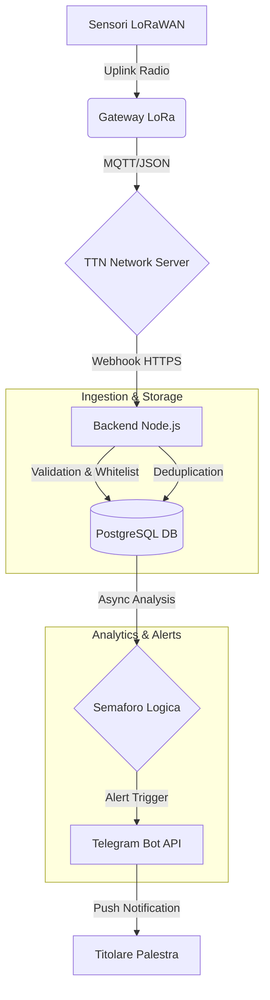

# Misuratore dati LORA — Telemetry & Monitoring System

Sistema di monitoraggio IoT enterprise-grade progettato per la raccolta, l'analisi e la notifica in tempo reale di telemetrie ambientali tramite protocollo LoRaWAN.

## 🏗️ Architettura del Sistema

Il sistema segue un pattern **Cloud-Native Event-Driven**:

1.  **Nodi IoT**: Sensori LoRaWAN (Temperatura, Umidità, CO2, Livello Idrico) inviano pacchetti criptati.
2.  **Gateway & Network Server (TTN)**: Il gateway riceve i segnali e The Things Network (TTN) decodifica i pacchetti, inoltrandoli tramite Webhook HTTPS.
3.  **Backend (Node.js/Render)**:
    *   **Ingestion Tier**: Valida il segreto `x-ingest-secret`, verifica la Whitelist ed esegue la deduplicazione tramite `f_cnt`.
    *   **Storage Tier**: Persistenza su **PostgreSQL** con partizionamento automatico per serie storiche.
    *   **Analytics Tier**: Coda di analisi asincrona che rileva anomalie (es. cali rapidi d'acqua, aria viziata).
4.  **Notification Tier (Telegram)**: Notifiche push intelligenti con gestione del cooldown (anti-flapping).



## 🚀 Guida all'Installazione (Local Dev)

### 1. Clonazione e Dipendenze
```bash
git clone <repository-url>
cd server
npm install
```

### 2. Configurazione Ambiente
Copia il file `.env.example` in `.env` e compila le variabili:
*   `DATABASE_URL`: Stringa di connessione PostgreSQL.
*   `INGEST_SECRET`: Chiave condivisa con il Webhook di TTN.
*   `TELEGRAM_BOT_TOKEN`: Token fornito da BotFather.
*   `AUTHORIZED_DEV_EUIS`: Lista di DevEUI autorizzati separati da virgola.

### 3. Avvio
```bash
npm run dev
```

## 🔐 Sicurezza e Best Practices

*   **Secrets Management**: Tutte le chiavi (DB, Telegram, Ingest) sono caricate esclusivamente tramite variabili d'ambiente (`.env`). Nessun segreto è cablato nel codice sorgente.
*   **Whitelist Rigorosa**: Solo i dispositivi presenti in `AUTHORIZED_DEV_EUIS` possono inviare dati. I tentativi non autorizzati generano un `SECURITY_ALERT`.
*   **Deduplicazione LoRaWAN**: Il sistema utilizza il `f_cnt` (Frame Counter) per ignorare pacchetti duplicati dalla rete, prevenendo race condition e dati inconsistenti sul database.
*   **Graceful Degradation**: Tutte le integrazioni esterne (DB, Telegram) sono protette da blocchi `try/catch`. Un fallimento nell'invio di una notifica non interrompe l'archiviazione dei dati.

## 🛠️ Manutenzione

### Aggiungere un nuovo sensore
1.  Aggiungi il DevEUI alla variabile `AUTHORIZED_DEV_EUIS` nel pannello di controllo (o `.env`).
2.  Il sistema eseguirà l'**Auto-Provisioning** al primo pacchetto ricevuto, configurando il sensore con parametri di default.
3.  Accedi all'area Admin per personalizzare nomi e soglie di allerta.

### Backup
Il sistema esegue un backup automatico del database ogni 24 ore nella cartella `backups/`, mantenendo una retention di 7 giorni.

---
*Progettato per la massima stabilità e resilienza operativa.*
